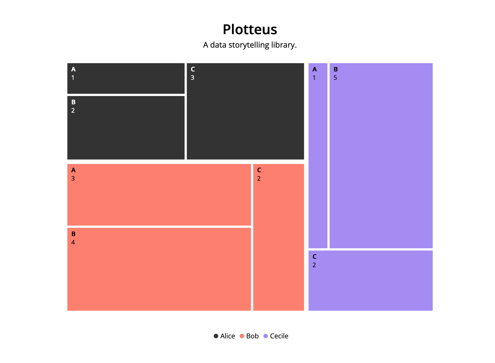
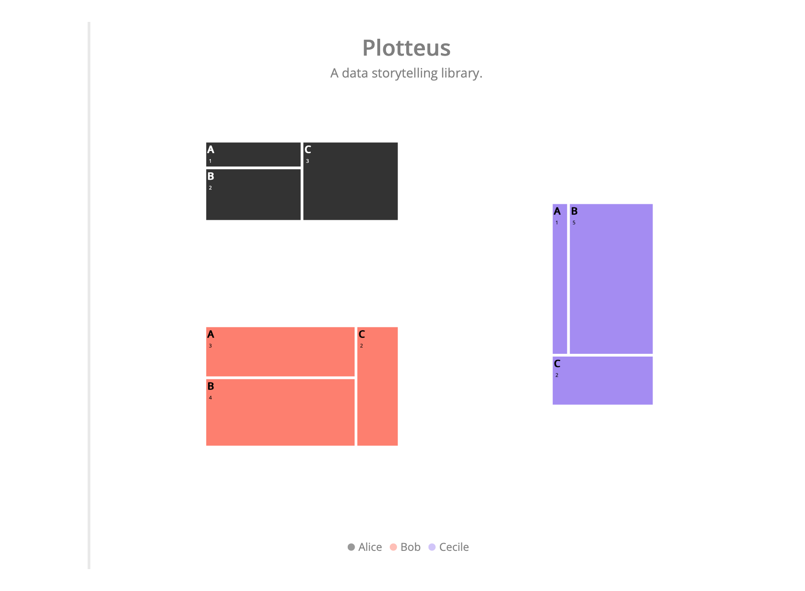
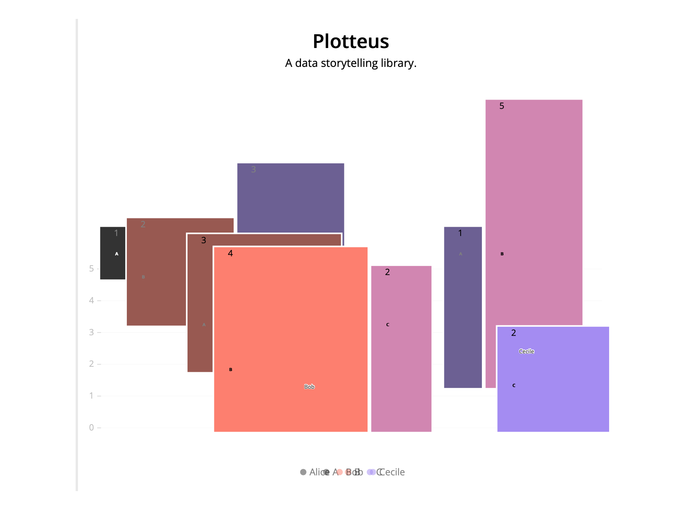
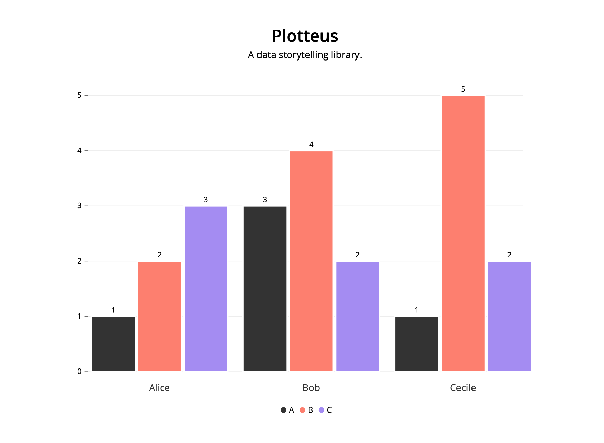

# Plotteus


**Plotteus** is a JavaScript library designed for better storytelling. Plotteus is a powerful tool that allows you to create interactive visualizations for your story from scratch, starting with defining a chart type, through seamless transitions between states, to giving you full control over them. Bet you'll fall in love at first chart?

## Installing

To install Plotteus, run `npm install plotteus`. Plotteus uses ES modules, so it can be used both in the Node.js environment as well as directly in the browser with `type="module"`.

**Node.js**

```ts
import { makeStory } from "plotteus";

const story = makeStory(div, steps);
```

**Browser**

```html
<script type="module">
  import { makeStory } from "https://cdn.jsdelivr.net/npm/plotteus";

  const story = makeStory(div, steps);
</script>
```

## Getting started

A core part of Plotteus is the `makeStory` function, which takes a `div` element and an array of `Steps` containing instructions on how to construct a story.

When called, it returns an object that exposes a `render` method that takes `stepKey` as the first argument and `progress` (a value between `0` and `1`) as the second argument.

Plotteus is based on transitions between consecutive steps. To animate things correctly, it uses key-matching between elements to determine whether they are entering, updating or exiting.

```ts
import { makeStory } from "plotteus";

const div = document.querySelector("#story");
const steps = [
  {
    key: "intro",
    chartType: "treemap",
    title: "Plotteus",
    titleAnchor: "middle",
    subtitle: "A data storytelling library.",
    subtitleAnchor: "middle",
    showValues: true,
    showDatumLabels: true,
    groups: [
      {
        key: "Alice",
        data: [
          { key: "A", value: 1 },
          { key: "B", value: 2 },
          { key: "C", value: 3 },
        ],
      },
      {
        key: "Bob",
        data: [
          { key: "A", value: 3 },
          { key: "B", value: 4 },
          { key: "C", value: 2 },
        ],
      },
      {
        key: "Cecile",
        data: [
          { key: "A", value: 1 },
          { key: "B", value: 5 },
          { key: "C", value: 2 },
        ],
      },
    ],
  },
];
const story = makeStory(div, steps);

story.render("intro", 1);
```



## Why should I use Plotteus?

### 🕹️ Fine-grained control

One of the strengths of Plotteus is that it gives you complete control over how to present your data stories. Popular approaches to data storytelling focus on using a bunch of charts that remain blended in the text or a sticky chart connected to a set of _triggers_ that start an animation when activated, usually by scrolling.

Plotteus gives you more freedom – it creates a set of interpolators that can be used to render a given part of a story at any progress. **This means that you can render your story incrementally as the user scrolls through the page, use a slider to control the progress or replicate the _trigger_ approach to completely render a step over a given duration.**

You have the power to choose.

### 🎬 Smooth transitions

Another behavior that is usually hard to achieve is the _smoothness_ of a story. Since some chart types may be better suited for a specific slice of the data better than others, it would be nice to be able to make a transition between them while keeping the data in context.

For example, you might want to highlight several parts of a treemap and compare them using a bar chart. Normally, you would have to _exit_ the entire treemap and _enter_ a new bar chart with only the data you need (which could make it difficult to keep the track of the parts being compared and their position in the previous treemap). **In Plotteus, you can seamlessly animate any chart type into any other chart type.**

Plotteus also makes it easy to do other _basic_ things that are also essential for data storytelling – like highlighting, sorting, or adding new data, all nicely animated.

### 💃 Fun

Limitless animations and a powerful mechanism to control them combined with a config-based approach, customizability, and responsiveness, make for a powerful combination that results in more enjoyable and memorable ways to tell your stories.

## API Reference

### 📊 Making a story

```ts
const div = document.querySelector("#story");
const groups: Group[] = [
  {
    key: "Alice",
    data: [
      { key: "A", value: 1 },
      { key: "B", value: 2 },
      { key: "C", value: 3 },
    ],
  },
  {
    key: "Bob",
    data: [
      { key: "A", value: 3 },
      { key: "B", value: 4 },
      { key: "C", value: 2 },
    ],
  },
  {
    key: "Cecile",
    data: [
      { key: "A", value: 1 },
      { key: "B", value: 5 },
      { key: "C", value: 2 },
    ],
  },
];
const baseStep = {
  title: "Plotteus",
  titleAnchor: "middle",
  subtitle: "A data storytelling library.",
  subtitleAnchor: "middle",
  showValues: true,
  showDatumLabels: true,
  groups,
};
const steps: Step[] = [
  {
    key: "zero",
    chartType: "treemap",
    ...baseStep,
  },
  {
    key: "one",
    chartType: "bar",
    ...baseStep,
  },
];
const story = makeStory(div, steps);
```

After a story is created, it can be rendered by passing `stepKey` and `progress` arguments to the `render` function. The third, optional boolean argument indicates whether the progress of the step should be displayed (left border of the SVG, default: `true`).

```ts
story.render("zero", 0.5);
```



```ts
story.render("zero", 1); // same as story.render("intro-2", 0)
```


```ts
story.render("one", 0.5);
```



```ts
story.render("one", 1);
```



And that's how it looks in action – animation is controlled by scrolling up or down.

https://user-images.githubusercontent.com/52032047/221407756-3038fae9-84ed-4d77-bb81-da74678ca4e9.mov

### ⚙️ Step configuration

```ts
type Step = {
  // Unique identifier of a step.
  // Passed as a first argument to the `render` method.
  key: string;
  chartType: "bar" | "bubble" | "pie" | "treemap";
  // Only applicable for bar chart.
  chartSubtype?: "grouped" | "stacked";
  title?: string;
  titleAnchor?: "start" | "middle" | "end";
  subtitle?: string;
  subtitleAnchor?: "start" | "middle" | "end";
  // If true, shares the color domain between groups.
  shareDomain?: boolean;
  showLegend?: boolean;
  legendAnchor?: "start" | "middle" | "end";
  showValues?: boolean;
  // Artificial maximum value.
  // Useful for fixing the value scale domain to show evolution of values.
  maxValue?: number;
  showDatumLabels?: boolean;
  // Only applicable for bar chart.
  verticalAxis?: {
    show?: boolean;
    title?: string;
  };
  palette?: "default" | "pastel" | "vivid" | "oranges";
  // If true, enables hand-drawn look.
  cartoonize?: boolean;
  // Data used to render a chart.
  groups: Array<{
    // Unique identifier of a group.
    // Will be used to match and animate the groups between consecutive steps.
    key: string;
    opacity?: number;
    data: Array<{
      // Unique identifier of a datum.
      // Will be used to match and animate the data inside a given group between
      // consecutive steps.
      key: string;
      value: number;
      // Use when you want to move a given datum across groups.
      // Should be defined as "groupKey:datumKey" for a datum from an exiting
      // group you want to "teleport" it from.
      teleportFrom?: string;
      // HEX, e.g. "#CCCCCC"
      fill?: string;
      opacity?: number;
    }>;
  }>;
};
```

### 🔠 Every group is a chart

One of the principles that makes it possible to _animate anything_ is the approach to the data itself. In Plotteus, you pass the data to create a chart in an array of `Group` objects – each `Group` contains an array of `Datum` objects.

You can think of each `Group` as a separate chart. Let's explain what this means on a chart-basis, assuming we want our chart to contain three elements: A, B, C, each with a numerical value assigned to it.

#### Bar

To make a bar chart, you need to pass three groups, each with one `Datum` attached.

```ts
const groups = [
  {
    key: "A",
    data: [{ key: "value", value: 1 }],
  },
  {
    key: "B",
    data: [{ key: "value", value: 2 }],
  },
  {
    key: "C",
    data: [{ key: "value", value: 3 }],
  },
];
```

While technically you could also make the same chart with just one `Group` and a `shareDomain = false`, the above approach makes it quite easy to make a proper grouped bar chart.

```ts
const groups = [
  {
    key: "A",
    data: [
      { key: "value", value: 1 },
      { key: "otherValue", value: 2 },
    ],
  },
  {
    key: "B",
    data: [
      { key: "value", value: 2 },
      { key: "otherValue", value: 3 },
    ],
  },
  {
    key: "C",
    data: [
      { key: "value", value: 3 },
      { key: "otherValue", value: 4 },
    ],
  },
];
```

#### Bubble, Pie, Treemap

For other chart types, you'll want to have one chart that contains all three values.

```ts
const groups = [
  {
    key: "firstGroup",
    data: [
      { key: "A", value: 1 },
      { key: "B", value: 2 },
      { key: "C", value: 3 },
    ],
  },
];
```

As with the bar chart, you could change the approach to using three `Groups` with one `Datum` each, if it better suits your needs. However, with the above approach, another group can easily be added.

```ts
const groups = [
  {
    key: "firstGroup",
    data: [
      { key: "A", value: 1 },
      { key: "B", value: 2 },
      { key: "C", value: 3 },
    ],
  },
  {
    key: "secondGroup",
    data: [
      { key: "A", value: 2 },
      { key: "B", value: 3 },
      { key: "C", value: 4 },
    ],
  },
];
```

You can structure your `Steps` to be based on either more groups (as with the bar chart) or fewer groups (other charts). The main difference between them is that, by default, the color domain is shared at the `Datum` level for bar and pie charts and at the `Group` level for other charts.

This decision comes from the experience that bar charts usually share the same domain within groups (so, _A_ in one group should have the same color as _A_ in all other groups). Pie charts, well, usually do not share the same color within the group, as you would end up with monochromatic slices. Bubble and treemap charts, on the other hand, usually have different "children" within groups. However, you can freely change this behavior by manually setting `shareDomain` to suit your needs, e.g. if you'd like to have a three-group bar chart with colors based on `Group` rather than `Datum`.

While this design gives you a lot of freedom to manipulate the elements, it can also pose a problem if you want to make some specific animations.

#### 🛸 Datum teleportation

For complex animations such as _extracting_ some data from a grouped bubble / pie / treemap chart to show a single grouped bar chart based on it, Plotteus offers _datum teleportation_.

To _teleport_ a `Datum` from a given **exiting** `Group`, you can add a `teleportFrom` property to it, in the form of a `previousGroupKey:previousDatumKey` string to intercept it from such a `Group` instead of showing a regular _entering_ animation.

```ts
// Step 1, bar chart.
const barChartGroups = [
  { key: "A", data: [{ key: "value", value: 1 }] },
  { key: "B", data: [{ key: "value", value: 2 }] },
  { key: "C", data: [{ key: "value", value: 3 }] },
];

// Step 2, pie chart.
const pieChartGroups = [
  {
    key: "pieGroup",
    data: [
      { key: "A", value: 1, teleportFrom: "A:value" },
      { key: "B", value: 2, teleportFrom: "A:value" },
      { key: "C", value: 3, teleportFrom: "A:value" },
    ],
  },
];

// Step 3 grouped bar chart.
const barChartGroups = [
  {
    key: "A",
    data: [
      { key: "value", value: 1, teleportFrom: "pieGroup:A" },
      { key: "otherValue", value: 2 },
    ],
  },
  {
    key: "B",
    data: [
      { key: "value", value: 2, teleportFrom: "pieGroup:B" },
      { key: "otherValue", value: 3 },
    ],
  },
  {
    key: "C",
    data: [
      { key: "value", value: 3, teleportFrom: "pieGroup:C" },
      { key: "otherValue", value: 4 },
    ],
  },
];
```

Keep in mind that this is mostly needed for advanced use cases – for basic stuff, the default built-in key matching should be sufficient.
